# Project Overview
this project takes an app called memos and hosts it on Amazon ECS which can be reached publicly on the internet through HTTPS
The project is split into two scopes: Bootstrap and Infra

**Bootstrap (+build.yaml)**:

Applied locally:
- Creates an s3 bucket and dynamodb lock table which are both used for handling terraform state
- An IAM role is created for GitHub Actions to use for OIDC (avoids static AWS keys)
- Another S3 bucket is created for collecting logs for the ALB
- The ECR Repository
- The Route 53 hosted zone

CI/CD:
- A docker image of the app is created and pushed to Amazon ECR using a Github actions workflow (upon pushing to github)

**Infra**:
- Using a manual github actions workflow, we create infrastructure using terraform onto AWS
- The terraform infrastructure is split across modules to handle everything separately
- This includes creating a network for this application
- The app is hosted on ECS Tasks within the network
- An ALB is used to route incoming traffic to the ECS tasks
- And Amazon cert manager is used to secure the domain for HTTPS
- and a subdomain is delegated to route 53 from cloudflare and used for the ECS task

When the app infrastructure is deployed, the memos app is available at:
```
https://memos.abuniyyah.uk
```

## Repository structure
```
.
├─ dockerfile                 # multi-stage build for the memos image
├─ .dockerignore
├─ memos/                     # app source (git submodule → usememos/memos)
├─ bootstrap/                 # Scope 1 — applied LOCALLY (foundational state)
│  ├─ main.tf                 # state bucket, lock table, logs bucket, R53 zone, ECR, OIDC + IAM role
│  ├─ provider.tf
│  ├─ locals.tf
│  ├─ outputs.tf              # consumed by infra via terraform_remote_state
│  └─ github-tight-policy.json
├─ infra/                     # Scope 2 — applied by CI (app infrastructure)
│  ├─ backend.tf              # S3 backend + reads bootstrap remote state
│  ├─ main.tf                 # wires the modules together
│  ├─ provider.tf / variables.tf / locals.tf / outputs.tf
│  └─ modules/
│     ├─ vpc/                 # VPC, public subnets, ALB SG + ECS task SG
│     ├─ alb/                 # ALB, listeners (80→443), target group
│     ├─ acm/                 # certificate + DNS validation records
│     └─ ecs/                 # cluster, service, task def, CloudWatch log group
├─ .github/workflows/
│  ├─ build.yaml              # build & push image to ECR (push/PR/dispatch)
│  ├─ deploy.yaml             # tf fmt/validate/tflint/apply → deploy to ECS → healthcheck (dispatch)
│  └─ destroy.yaml            # terraform destroy (dispatch)
├─ documents/                 # architecture diagrams (scope 1 + scope 2)
└─ README.md
```

# Architecture Diagram

### Scope 1 — Bootstrap


### Scope 2 — Infrastructure


# Reproduction Instructions
the dense part. Walk through bootstrap → NS records in Cloudflare → infra apply → CI/CD.

## Cloud Set-Up
**Pre-Requisities**:
First you need to have an AWS account and you need to configure it to your local Command Line Interface.

CLI configuration:
First download the AWS CLI if you do not already have it
Then:
```
aws configure
```
Follow the prompts and enter the following details:
- 1. AWS Access Key ID: Paste the Access Key associated with your IAM user 
- 2. AWS Secret Access Key: Paste the Secret Key associated with your IAM user
- 3. Default Region Name: e.g. 'eu-west-2'
- 4. Default Output Format: JSON

Domain:
You also need to own a domain
Go to any domain registrar, such as cloudflare, and purchase a domain.

Github Repository:
Fork the github repository and pull it to your working folder

Use:
```
git clone --recurse-submodules <your-fork-url>
cd <your-fork>
```

```
gh auth login
```
(install 'gh' with your package manager if you do not already have it)

```
./setup.sh
```
(This will make the project hold your specific variables)

**Bootstrap**:
Use:
```
cd bootstrap
terraform init
terraform apply
```

Rename 'bootstrap/backend.tf.disabled' to 'bootstrap/backend.tf'
Run:
```
terraform init -migrate-state
terraform apply
```

**Manual**:
- From the output of the bootstrap terraform apply, 4 nameservers are outputted
- Those must be pasted as NS records into the domain registrar of the domain (or subdomain) you own
- This delegates authority over it to route 53

**build.yaml**:
Use:
```
git push origin main
```

This will activate the build.yaml workflow
which will create a docker image and push it to Amazon ECR

The workflow can also be activated manually in the github actions menu
build.yaml must be run and completed before using deploy.yaml

**deploy.yaml**:
In the github actions menu, activate deploy.yaml
This can only be done manually

Certificate validation can take 10-15 minutes, so you will need to wait

**terminal commands**:
You can use the following commands to run the workflows from the terminal:
```
gh workflow run build.yaml
gh workflow run deploy.yaml
gh workflow run destroy.yaml
```

You can also monitor your workflows from the terminal using:
```
gh run list
# See recent runts + their status
gh run watch
# live-follow the latest run until it finishes
gh run view view --log
# Full logs of a run
```

**verify**:
Visit [https://<domain-name>] and check if it is working
[https://<domain-name>/healthz] can be used for health status checking

## Local Set-Up
Open docker engine

Run in terminal:
```
docker build -t memos -f dockerfile ./memos
docker run --rm --name memos -p 8081:8081 -v ~/.memos:/var/opt/memos memos
```

Visit 'http://localhost:8081' to use your container
Healthcheck: 'http://localhost:8081/healthz'

## APP Demo Video

# Screenshots

## Live Application (HTTPS)

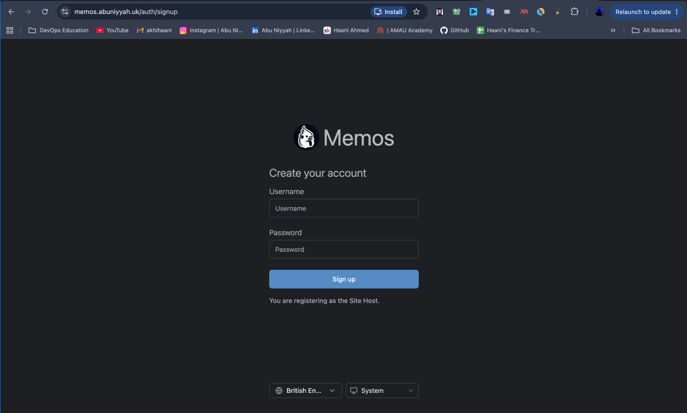

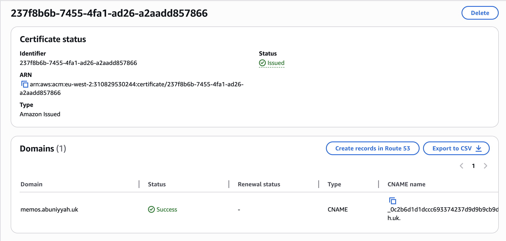

## CI/CD Pipelines

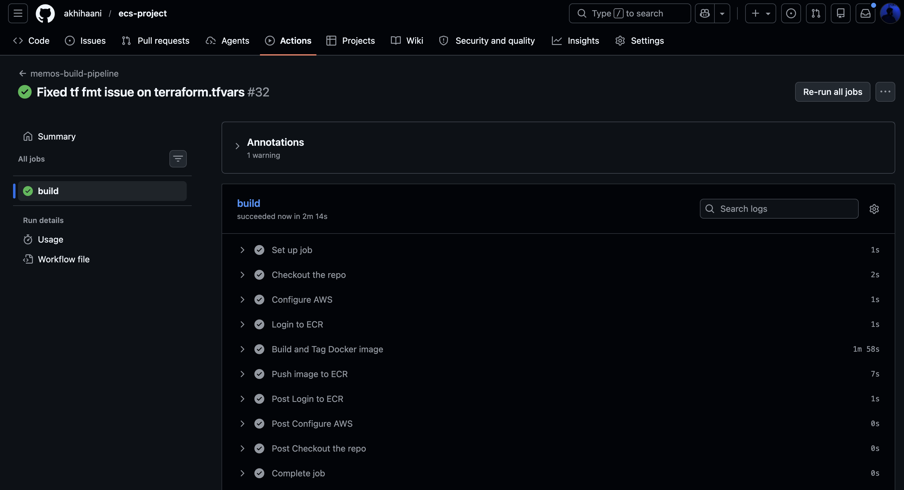

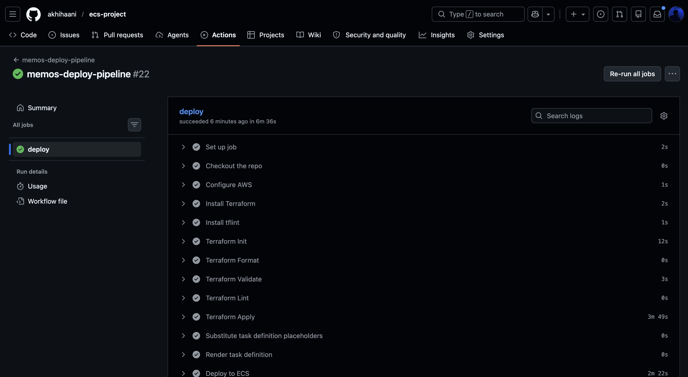

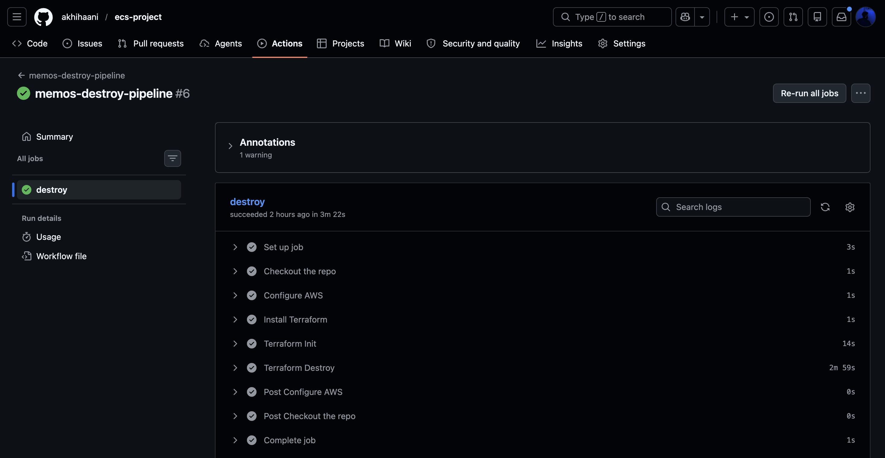

## AWS Infrastructure

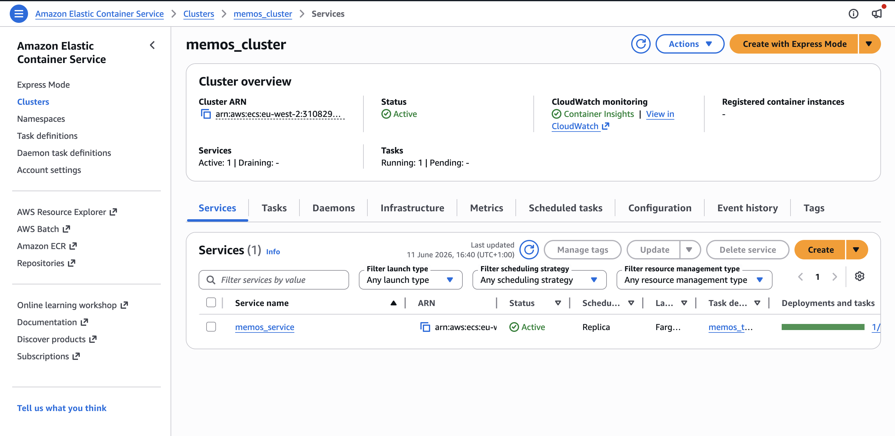

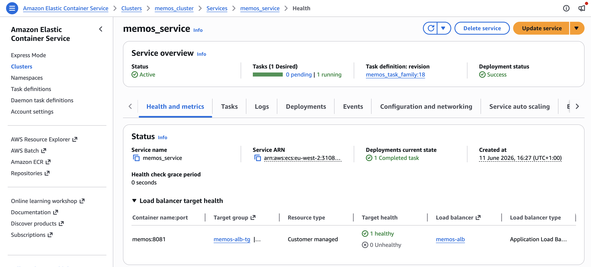

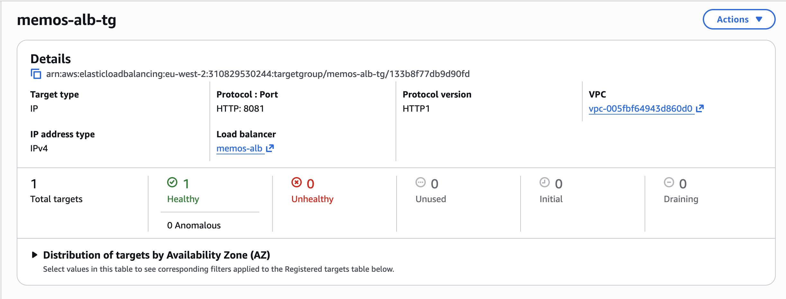

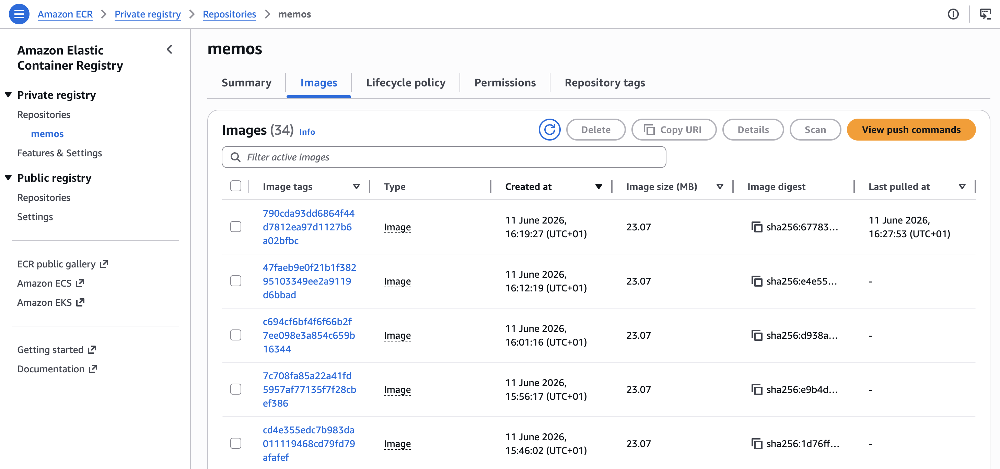

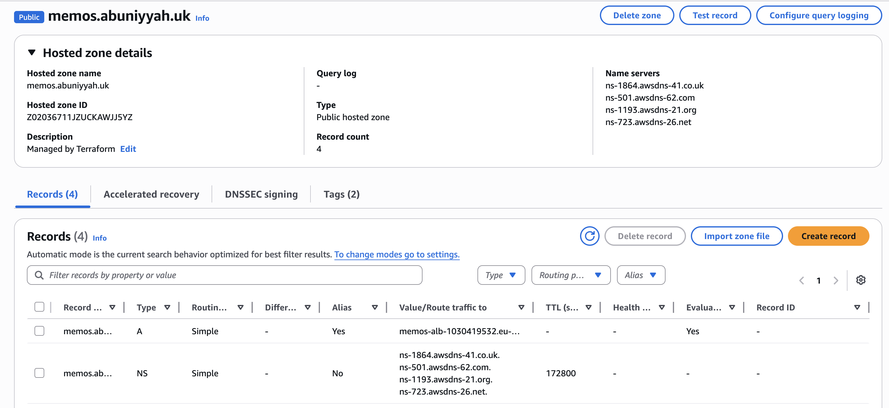

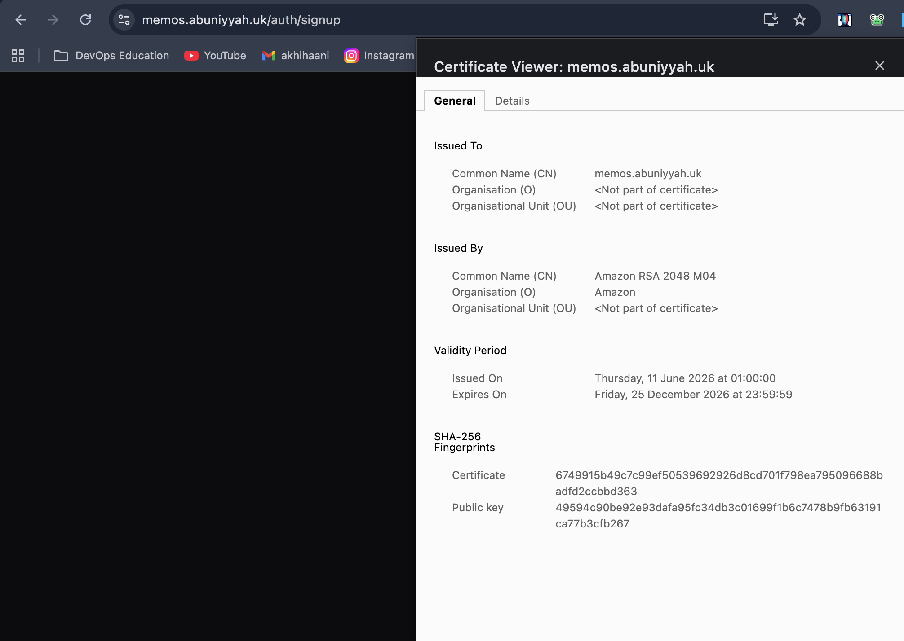

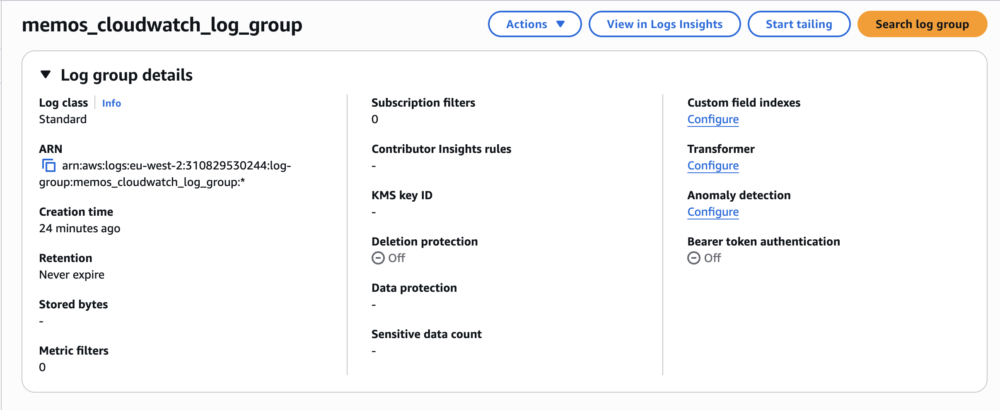

## Local Container

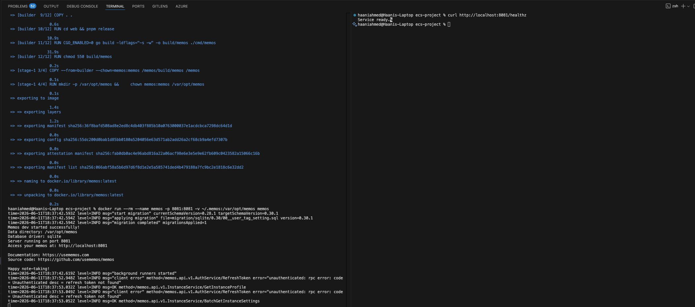

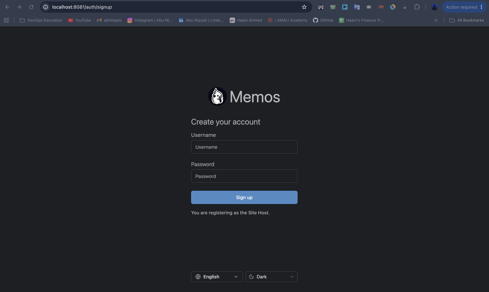